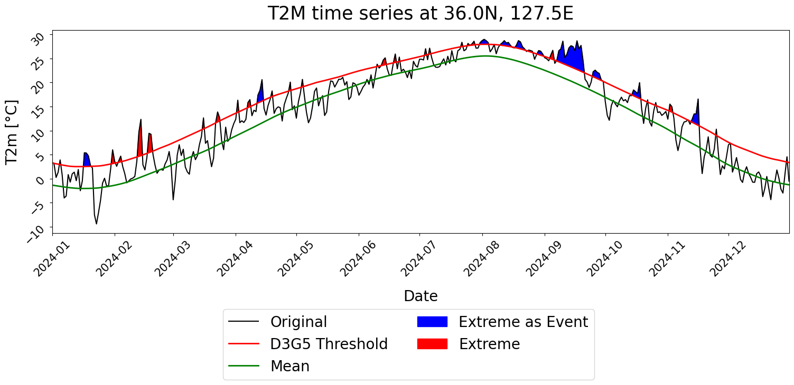
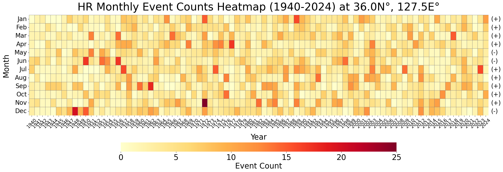
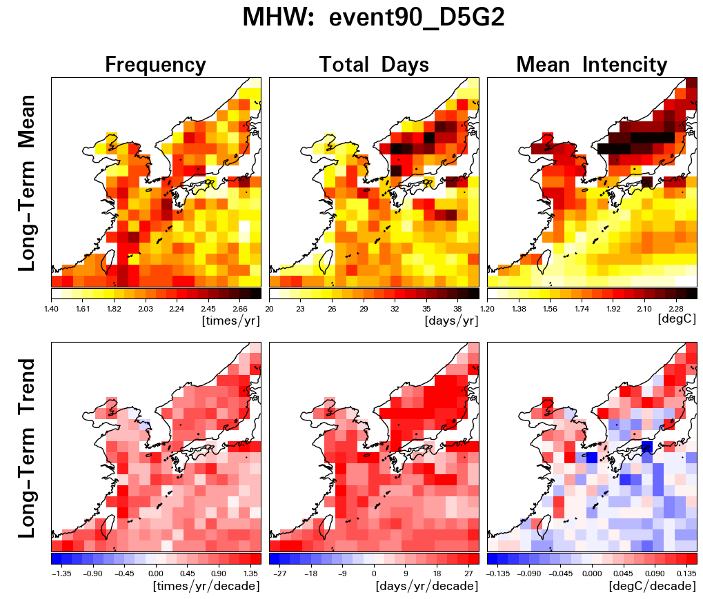
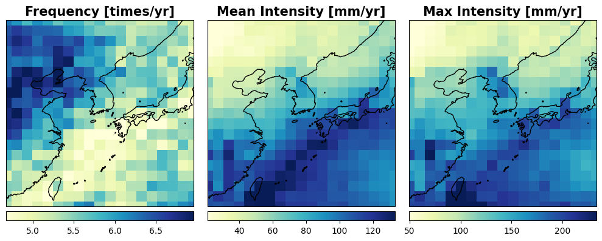

## 🧮 Codes for Data Processing and Visualization
- Location: [ EastAsiaClimateExtremes/CODES/](./CODES/)

| Code File | Description |
| ------ | ----- | 
| [`Extreme_Event_Statistics_and_Visualization_1.ipynb`](./CODES/Extreme_Event_Statistics_and_Visualization_1.ipynb) | Code for timeseries and heatmap visualization |
| [`Extreme_Event_Statistics_and_Visualization_2.py`](./CODES/Extreme_Event_Statistics_and_Visualization_2.py)| Code for calculating and displaying long-term mean and trend of event statistics |
| [`Weekly_Extreme_Statistics_and_Visualization.ipynb`](./CODES/Weekly_Extreme_Statistics_and_Visualization.ipynb) | Code for 2-D map visualization of long-term statistics of weekly climate extremes |
&nbsp;  
  
## 📊 Output Details 
### ***0. Historical Extreme Statistics***  
- Daily/Weekly Timeseries of *T2M/TP/SST* and isolated AHT/HR/MHW events 

*for AHT/HR/MHW,*  
- Event Statistics: Frequeny, Duration, Mean Intensity  
- Weekly Extreme Statistics: Frequeny, Mean/Max Intensity per year  
 
### ***1. Seasonality and Trend of Climate Extremes***  
- Seasonal Evolution of Event Frequency/Duration/Mean Intensity  
- Annual Timeseries of Frequency/Duration/Mean Intensity per Year and its Least-Squared Fitted Line

### ***2. Example images after runing codes***   

&nbsp;&nbsp;&nbsp;&nbsp;&nbsp;&nbsp;&nbsp;&nbsp;**2.0. Line plot of daily timeseries: climatology, extreme threshold, events**  
&nbsp;&nbsp;&nbsp;&nbsp;&nbsp;&nbsp;&nbsp;&nbsp;***(from [`Extreme_Event_Statistics_and_Visualization_1.ipynb`](./Extreme_Event_Statistics_and_Visualization_1.ipynb))***  
&nbsp;&nbsp;&nbsp;&nbsp;&nbsp;&nbsp;&nbsp;&nbsp;+ *T2m timeseries & Anomalous High Temerature event (D5G2, 90%tile)*  

  

&nbsp;  
&nbsp;&nbsp;&nbsp;&nbsp;&nbsp;&nbsp;&nbsp;&nbsp;**2.1. Heatmap of Monthly Extreme Event Statistics: frequency and trend**  
&nbsp;&nbsp;&nbsp;&nbsp;&nbsp;&nbsp;&nbsp;&nbsp;***(from [`Extreme_Event_Statistics_and_Visualization_1.ipynb`](./Extreme_Event_Statistics_and_Visualization_1.ipynb))***  
&nbsp;&nbsp;&nbsp;&nbsp;&nbsp;&nbsp;&nbsp;&nbsp;+ *Monthly count of heavy rainfall events(D1G3, 90%tile) with trend (+/-)*  

  

&nbsp;  
&nbsp;&nbsp;&nbsp;&nbsp;&nbsp;&nbsp;&nbsp;&nbsp;**2.2. 2D Maps of Extreme "Event" Statistics: long-term mean/trend of frq./duration/mean intensity**  
&nbsp;&nbsp;&nbsp;&nbsp;&nbsp;&nbsp;&nbsp;&nbsp;***(from [`Extreme_Event_Statistics_and_Visualization_2.py`](./Extreme_Event_Statistics_and_Visualization_2.py))***  
&nbsp;&nbsp;&nbsp;&nbsp;&nbsp;&nbsp;&nbsp;&nbsp;+ *Marin Heatwave event (D5G2, 90%tile) statistics (1982-2024)*  

  
&nbsp;  
&nbsp;&nbsp;&nbsp;&nbsp;&nbsp;&nbsp;&nbsp;&nbsp;**2.3. 2D Maps of "Weekly" Extremes Statistics**  
&nbsp;&nbsp;&nbsp;&nbsp;&nbsp;&nbsp;&nbsp;&nbsp;***(from [`Weekly_Extreme_Statistics_and_Visualization.ipynb`](./Weekly_Extreme_Statistics_and_Visualization.ipynb))***  
&nbsp;&nbsp;&nbsp;&nbsp;&nbsp;&nbsp;&nbsp;&nbsp;+ *Counts of extreme weeks and their mean/max intensity per year based on weekly accumulated precipitation (1940-2024)*  

  

  

