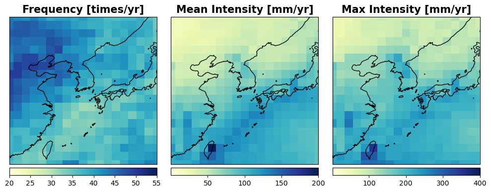

### 🧮 Codes for Data Processing and Visualization
| Code File | Description | Location |
| ------ | ----- | ----- |
| `TART_visualization1_output.ipynb` | Code for timeseries and heatmap visualization | EastAsiaClimateExtremes/CODES/|
| `TART_visualization2_output.ipynb` | Code for 2-D map visualization of long-term statistics of weekly climate extremes | EastAsiaClimateExtremes/CODES/|
| `0.display_EAextremes_event_statistics.py`| Code for calculating and displaying long-term mean and trend of extreme events | EastAsiaClimateExtremes/CODES/ |
  
&nbsp;  
  
### 📊 Output Details 
***0. Historical Extreme Statistics***  
- Daily/Weekly Timeseries and Extremeness
- List of Events: *AHT, HR, MHW*  
- Event Statistics: Frequeny, Duration, Mean Intensity 
- Weekly Extreme Statistics: Frequeny, Mean/Max Intensity per year  
 
***1. Seasonality and Trend of Climate Extremes***  
- Seasonal Evolution of Event Frequency/Duration/Mean Intensity  
- Annual Timeseries of Frequency/Duration/Mean Intensity per Year and its Least-Squared Fitted Line

&nbsp;    
***2. Example images after runing codes***  
  
&nbsp;  
&nbsp;&nbsp;&nbsp;&nbsp;&nbsp;&nbsp;&nbsp;&nbsp;**2.0. 2D Maps of Long-term Statistics of Weekly Extreme Frequency/Mean/Max. Intensity**  

&nbsp;  
&nbsp;&nbsp;&nbsp;&nbsp;&nbsp;&nbsp;&nbsp;&nbsp;**2.1. Heavy Rainfall with 90th percentile threshold** ***(from `TART_visualization1_output.ipynb`)***  
&nbsp;&nbsp;&nbsp;&nbsp;&nbsp;&nbsp;&nbsp;&nbsp;+ *Heatmap of monthly count of heavy rainfall events (D1G3) with trend (+/-)*  

  

&nbsp;&nbsp;&nbsp;&nbsp;&nbsp;&nbsp;&nbsp;&nbsp;**2.2. 2D Maps of Event statistics: long-term mean/trend of frq./duration/mean intensity** ***(from `0.display_EAextremes_event_statistics.py`)***  
&nbsp;&nbsp;&nbsp;&nbsp;&nbsp;&nbsp;&nbsp;&nbsp;+ *Marin Heatwave event (D5G2, 90%tile) statistics (1982-2024)*  

  

